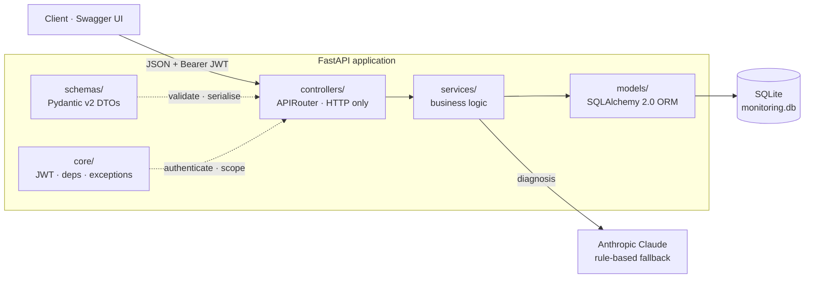
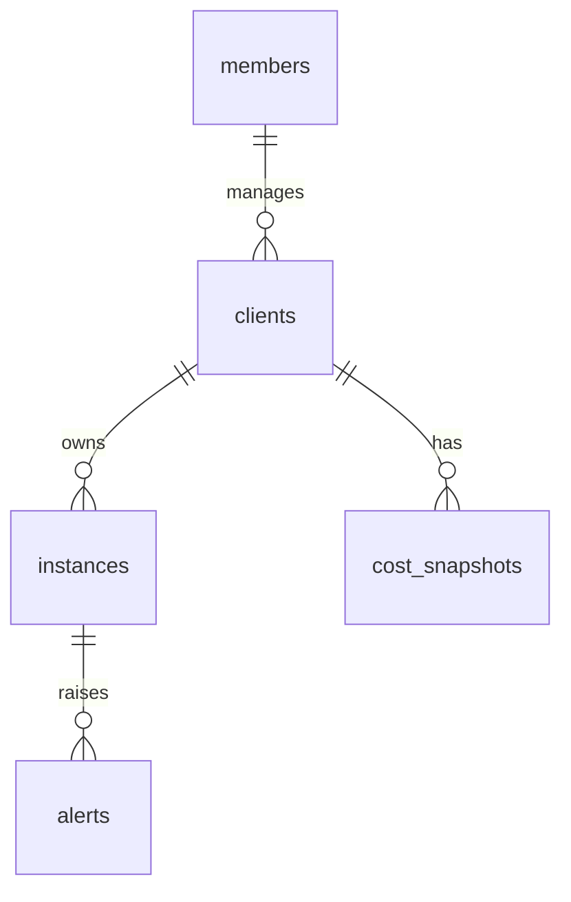
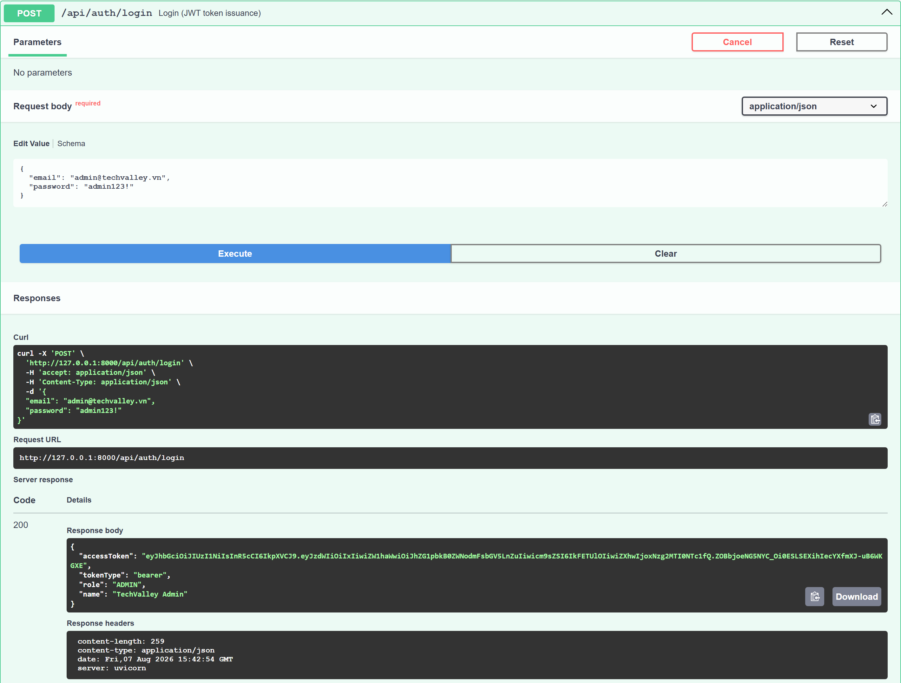
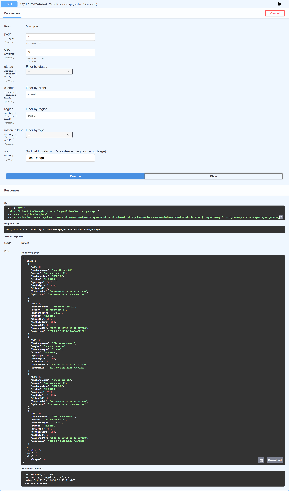
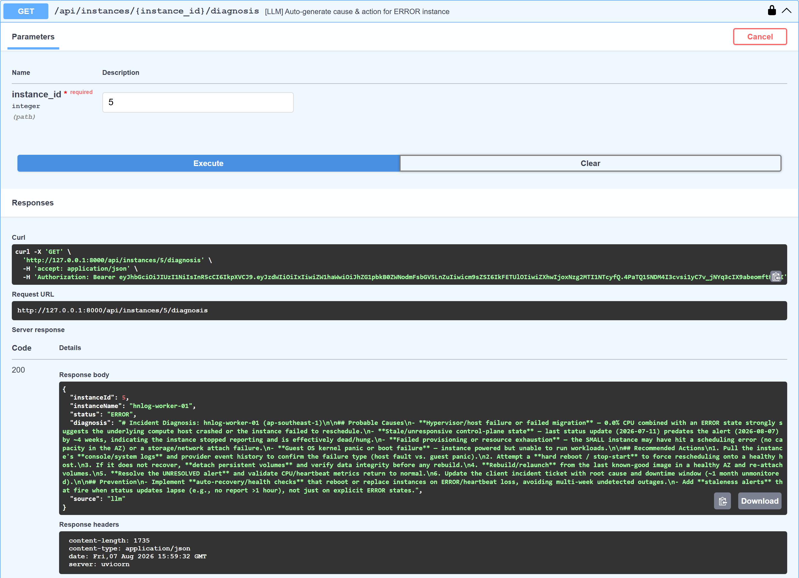
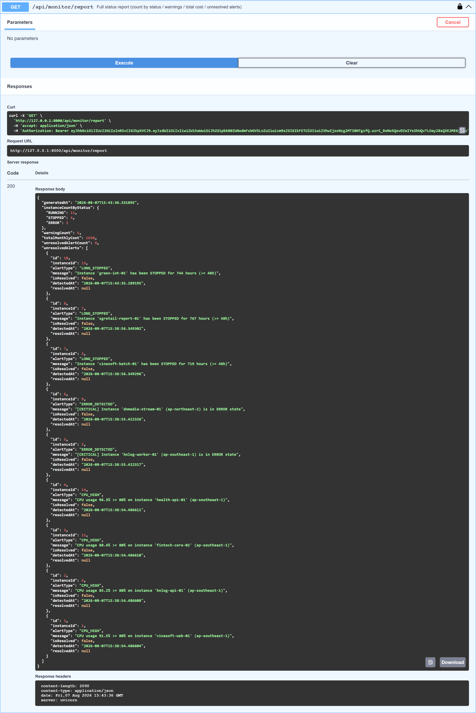

<div align="center">

# ☁️ TechValley — Cloud Instance Monitoring System

**A REST API that replaces the Excel spreadsheet 10 client companies were tracked in.**

Instances, alerts, cost, SLA and an LLM-powered diagnosis endpoint — behind JWT auth,
role scoping and 125 functional tests.

<br/>

[](https://www.python.org/)
[](https://fastapi.tiangolo.com/)
[](https://docs.sqlalchemy.org/en/20/)
[](https://docs.pydantic.dev/latest/)

[](docs/api/AUTHENTICATION.md)
[](docs/design/ERD.md)
[](docs/design/LLM_FEATURE.md)
[](docs/testing/FUNCTIONAL_TESTS.md)
[](docs/api/ENDPOINTS.md)
[](LICENSE)

<br/>

[**Quick Start**](#-quick-start) ·
[**API**](#-api-at-a-glance) ·
[**Architecture**](#-architecture) ·
[**Screenshots**](#-screenshots) ·
[**Docs**](#-documentation) ·
[**Tests**](#-tests)

</div>

---

## ✨ Highlights

|  | Feature | What it does |
|:--:|---|---|
| 🔐 | **JWT auth + role scoping** | `ADMIN` sees everything; `CLIENT_MANAGER` only their assigned clients — enforced in one dependency, not per endpoint |
| 🖥️ | **Instance lifecycle** | Create, list, filter, sort, change status; a `RUNNING` instance cannot be deleted (`409`) |
| 📄 | **Paginated everywhere** | All seven list endpoints share one `page`/`size` pair and one `PageResponse` envelope, so no response grows with the table |
| 🚨 | **Automatic alerting** | Monitoring scans raise `CPU_HIGH`, `ERROR_DETECTED` and `LONG_STOPPED` alerts, and skip duplicates while one is unresolved |
| 💵 | **Cost & forecast** | `SMALL $50` / `MEDIUM $120` / `LARGE $250` per month; the forecast counts only `RUNNING` instances |
| 📈 | **SLA reporting** | `PREMIUM 99.9%` / `STANDARD 99%` / `BASIC 95%`, with per-instance uptime detail |
| 🤖 | **LLM diagnosis** | Claude explains why an instance is unhealthy — and falls back to a rule-based answer with no API key, so the demo never breaks |
| 📚 | **Documented end to end** | Fifteen documentation folders: requirements (BRD/SRS/FRS/use cases), API reference, business rules, ERD, user manual, walkthrough, test cases, performance and security findings |
| ✅ | **125 functional tests** | Driven over HTTP against a per-test in-memory database — no API key, no running server |

---

## 🚀 Quick Start

```bash
# 1 · Create a virtualenv and install dependencies
python -m venv .venv
.venv\Scripts\activate          # Windows  (Linux/macOS: source .venv/bin/activate)
pip install -r requirements.txt

# 2 · (Optional) configure — defaults work out of the box
copy .env.example .env

# 3 · Run
uvicorn app.main:app --reload
```

> 🔗 **Swagger UI → <http://127.0.0.1:8000/docs>**
>
> `monitoring.db` is created and **seeded automatically** on first run —
> 3 members, 10 clients, 15 instances, cost snapshots.

### Log in

| Role | Email | Password | Sees |
|---|---|---|---|
| `ADMIN` | `admin@techvalley.vn` | `admin123!` | All 10 clients, all 15 instances |
| `CLIENT_MANAGER` | `lam@techvalley.vn` | `manager123!` | Clients **1–5** |
| `CLIENT_MANAGER` | `minh@techvalley.vn` | `manager123!` | Clients **6–10** |

<details>
<summary><b>Two-command smoke test with curl</b></summary>

<br/>

```bash
# Get a token
curl -s -X POST http://127.0.0.1:8000/api/auth/login \
  -H "Content-Type: application/json" \
  -d "{\"email\":\"admin@techvalley.vn\",\"password\":\"admin123!\"}"

# Use it
curl -s "http://127.0.0.1:8000/api/instances?sort=-cpuUsage&size=5" \
  -H "Authorization: Bearer <accessToken>"
```

</details>

Then follow the guided demo: **[docs/demo/WALKTHROUGH.md](docs/demo/WALKTHROUGH.md)** —
or read the source in order: **[docs/onboarding/READING_ORDER.md](docs/onboarding/READING_ORDER.md)**.

---

## 🧭 Architecture

MVC layering — a request never skips a layer, and each business rule lives in exactly one
place.



| Layer | Directory | Responsibility |
|---|---|---|
| **M** | [app/models/](app/models/) | SQLAlchemy 2.0 ORM entities — five tables |
| **V** | [app/schemas/](app/schemas/) | Pydantic v2 request/response DTOs |
| **C** | [app/controllers/](app/controllers/) | Routers — parse, delegate, return |
| — | [app/services/](app/services/) | Monitoring, alerts, cost, SLA, LLM |
| — | [app/core/](app/core/) | JWT security, auth dependencies, domain exceptions |

Full write-up: [docs/design/ARCHITECTURE.md](docs/design/ARCHITECTURE.md) ·
data model: [docs/design/ERD.md](docs/design/ERD.md).

<details>
<summary><b>Data model at a glance</b></summary>

<br/>



Columns, constraints and derived fields: [docs/design/ERD.md](docs/design/ERD.md).

</details>

---

## 🔌 API at a glance

Nineteen endpoints across five routers, plus a `GET /` health check. Full detail in
**[docs/api/ENDPOINTS.md](docs/api/ENDPOINTS.md)**.

| Group | Endpoints |
|---|---|
| 🔑 **Auth** | `POST /api/auth/login` |
| 🖥️ **Instances** | `POST` · `GET` `/api/instances` · `GET /{id}` · `PATCH /{id}/status` · `DELETE /{id}` · `GET /{id}/diagnosis` |
| 📡 **Monitoring** | `GET /api/monitor/warnings` · `/errors` · `/long-stopped` · `/report` |
| 🚨 **Alerts** | `GET /api/alerts` · `PATCH /api/alerts/{id}/resolve` |
| 🏢 **Clients** | `POST` · `GET` `/api/clients` · `GET /{id}/instances` · `/cost` · `/cost-forecast` · `/sla` |

Every list endpoint takes `page`, `size`, filters and `sort` (`-field` for descending) and
answers in the same envelope; every error answers as `{"error": ..., "detail": ...}`. See
[CONVENTIONS.md](docs/api/CONVENTIONS.md) and [ERRORS.md](docs/api/ERRORS.md).

### Key behaviours

Each rule is documented in **[docs/business-rules/](docs/business-rules/README.md)**:

- 🔐 **Role scoping** — ADMIN sees everything; CLIENT_MANAGER only their assigned clients.
- 🚨 **Automatic alerts** — monitoring scans record alerts and skip duplicates while an
  unresolved alert of the same type exists.
- ⛔ **RUNNING instances cannot be deleted** — `409 ActiveInstanceException`.
- 💵 **Cost** — SMALL $50 / MEDIUM $120 / LARGE $250 per month; the forecast counts only
  RUNNING instances.
- 📈 **SLA** — PREMIUM 99.9% / STANDARD 99% / BASIC 95%, with a documented uptime
  approximation.
- 🤖 **LLM diagnosis** — falls back to a rule-based answer with no API key, so the demo
  never breaks.

---

## 📸 Screenshots

Captured from Swagger UI against a freshly seeded database — all 29 in
[docs/screenshots/](docs/screenshots/README.md).

| Login → token | Instances, sorted and paginated |
|---|---|
|  |  |
| **LLM diagnosis** | **Monitoring report** |
|  |  |

---

## 🧪 Tests

```bash
pip install -r requirements-dev.txt
pytest -q          # 125 functional tests — no API key, no running server
```

The suite drives the API over HTTP against a per-test **in-memory** database seeded with
the same demo data, so its expected values are exact rather than approximate.

| Document | Contents |
|---|---|
| [docs/testing/RUNNING_TESTS.md](docs/testing/RUNNING_TESTS.md) | How to run the suite |
| [docs/testing/FUNCTIONAL_TESTS.md](docs/testing/FUNCTIONAL_TESTS.md) | What every suite asserts |

⚡ Latency, throughput and concurrency were measured separately — 15 findings, three rated
critical, nine fixed so far:
[docs/performance/PERFORMANCE_BUGS.md](docs/performance/PERFORMANCE_BUGS.md).

🔐 Injection, information disclosure and session integrity were reviewed the same way —
15 reproduced findings, two rated critical, none fixed yet:
[docs/security/SECURITY_BUGS.md](docs/security/SECURITY_BUGS.md).

---

## 📚 Documentation

Full documentation lives in **[docs/](docs/README.md)**. Each folder has its own README
linking to the files inside it.

| Folder | Contents |
|---|---|
| 🧭 [docs/onboarding/](docs/onboarding/README.md) | How to read this codebase for the first time, function by function |
| 📋 [docs/requirements/](docs/requirements/README.md) | BRD, SRS, FRS and the use case / user story specification |
| 📘 [docs/api/](docs/api/README.md) | Overview, authentication, request conventions, errors, per-endpoint reference |
| 📗 [docs/business-rules/](docs/business-rules/README.md) | Authorization, instance lifecycle, alerting, cost, SLA |
| 📖 [docs/manual/](docs/manual/README.md) | End-user manual for operating the system |
| 📙 [docs/demo/](docs/demo/README.md) | Demo accounts, seed data, step-by-step walkthrough |
| 📐 [docs/design/](docs/design/README.md) | Architecture, ERD, database engine, LLM feature design |
| 🧪 [docs/testing/](docs/testing/README.md) | Functional test suite and how to run it |
| ⚡ [docs/performance/](docs/performance/README.md) | Measured latency, throughput and concurrency findings |
| 🔐 [docs/security/](docs/security/README.md) | Reproduced injection, disclosure and session findings |
| 🛠️ [docs/operations/](docs/operations/README.md) | Deploying, configuring and troubleshooting a running deployment |
| 👥 [docs/team/](docs/team/README.md) | Per-member assignment scope |
| 🤝 [docs/contributing/](docs/contributing/README.md) | Commit conventions and documentation rules |
| 🗓️ [docs/changelog/](docs/changelog/README.md) | What changed in this repository, and when |
| 📸 [docs/screenshots/](docs/screenshots/README.md) | Captured Swagger UI responses |

<details open>
<summary><b>Direct links</b></summary>

<br/>

| Topic | Document |
|---|---|
| Reading order for new contributors | [docs/onboarding/READING_ORDER.md](docs/onboarding/READING_ORDER.md) |
| Business requirements (BRD) | [docs/requirements/BRD.md](docs/requirements/BRD.md) |
| Software requirements (SRS) | [docs/requirements/SRS.md](docs/requirements/SRS.md) |
| Functional specification (FRS) | [docs/requirements/FRS.md](docs/requirements/FRS.md) |
| Use cases and user stories | [docs/requirements/USE_CASES.md](docs/requirements/USE_CASES.md) |
| User manual | [docs/manual/USER_MANUAL.md](docs/manual/USER_MANUAL.md) |
| API endpoint reference | [docs/api/ENDPOINTS.md](docs/api/ENDPOINTS.md) |
| Authentication and JWT | [docs/api/AUTHENTICATION.md](docs/api/AUTHENTICATION.md) |
| Pagination, filtering, sorting | [docs/api/CONVENTIONS.md](docs/api/CONVENTIONS.md) |
| Status codes and error bodies | [docs/api/ERRORS.md](docs/api/ERRORS.md) |
| Business rules | [docs/business-rules/README.md](docs/business-rules/README.md) |
| Demo accounts | [docs/demo/ACCOUNTS.md](docs/demo/ACCOUNTS.md) |
| Demo walkthrough | [docs/demo/WALKTHROUGH.md](docs/demo/WALKTHROUGH.md) |
| Data model (ERD) | [docs/design/ERD.md](docs/design/ERD.md) |
| Architecture | [docs/design/ARCHITECTURE.md](docs/design/ARCHITECTURE.md) |
| Database engine and in-memory SQLite | [docs/design/DATABASE.md](docs/design/DATABASE.md) |
| LLM diagnosis feature | [docs/design/LLM_FEATURE.md](docs/design/LLM_FEATURE.md) |
| Running the tests | [docs/testing/RUNNING_TESTS.md](docs/testing/RUNNING_TESTS.md) |
| What the tests cover | [docs/testing/FUNCTIONAL_TESTS.md](docs/testing/FUNCTIONAL_TESTS.md) |
| Test cases with steps and expected results | [docs/testing/TEST_CASES.md](docs/testing/TEST_CASES.md) |
| Performance bugs and fixes | [docs/performance/PERFORMANCE_BUGS.md](docs/performance/PERFORMANCE_BUGS.md) |
| Security bugs and fixes | [docs/security/SECURITY_BUGS.md](docs/security/SECURITY_BUGS.md) |
| Deploying, upgrading, rolling back | [docs/operations/DEPLOYMENT.md](docs/operations/DEPLOYMENT.md) |
| Settings, secrets and API keys | [docs/operations/CONFIGURATION.md](docs/operations/CONFIGURATION.md) |
| Incident runbooks — crashes and outages | [docs/operations/RUNBOOKS.md](docs/operations/RUNBOOKS.md) |
| Commit conventions | [docs/contributing/COMMITS.md](docs/contributing/COMMITS.md) |
| Documentation rules | [docs/contributing/DOCUMENTATION.md](docs/contributing/DOCUMENTATION.md) |
| Change history | [docs/changelog/CHANGELOG.md](docs/changelog/CHANGELOG.md) |

</details>

---

## 🗂️ Project Structure

```
app/
├── main.py              # FastAPI app, routers, exception handlers, startup seed
├── config.py            # Settings, unit pricing, SLA thresholds
├── database.py          # SQLAlchemy engine/session
├── seed.py              # Idempotent demo data
├── models/              # M — SQLAlchemy ORM entities
├── schemas/             # V — Pydantic request/response DTOs
├── controllers/         # C — API routers
├── services/            # Business logic — monitoring, alerts, cost, SLA, LLM
└── core/                # JWT security, auth dependencies, domain exceptions
docs/                    # Documentation — see docs/README.md
tests/                   # pytest functional tests
scripts/                 # Swagger UI screenshot capture, docs-sync check
```

---

## 🤝 Contributing

Documentation is written in **English** and changes in the **same commit** as the code it
describes. Before changing code, read the document covering that area — the
source-to-document mapping is in
[docs/contributing/DOCUMENTATION.md](docs/contributing/DOCUMENTATION.md).

Commit subjects carry a type prefix — `feat:` · `fix:` · `docs:` · `refactor:` · `test:`.
See [docs/contributing/COMMITS.md](docs/contributing/COMMITS.md).

`scripts/check_docs_sync.py` reminds you at commit time: it names the documents the
mapping asks for that were not staged with the code. It warns rather than blocks —
install it with `git config core.hooksPath scripts/hooks`.

---

<div align="center">

Built for the **TechValley Developer Track** assignment · [MIT License](LICENSE)

</div>
