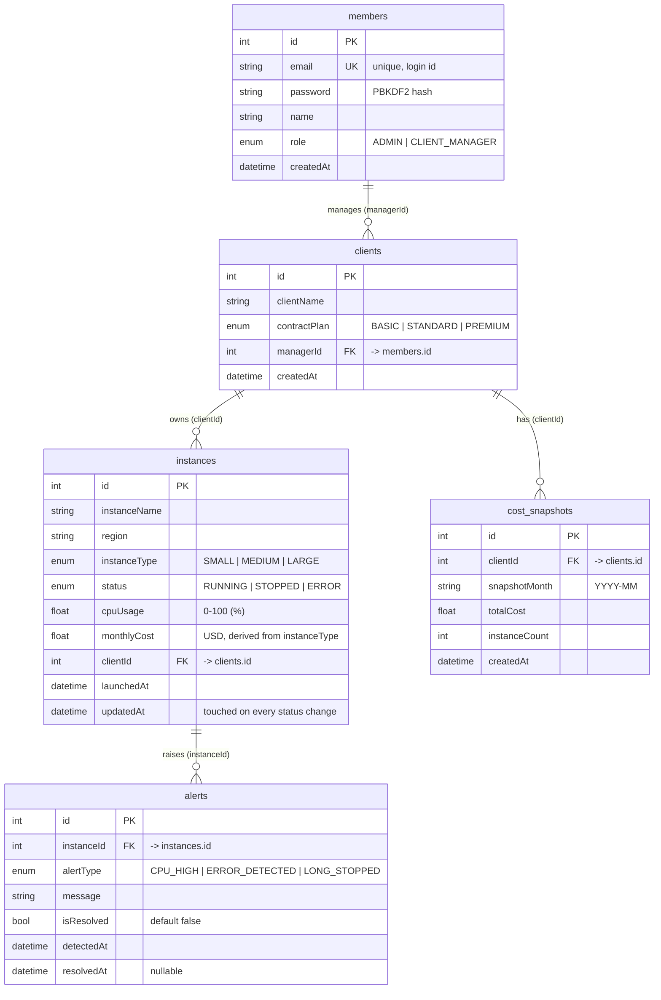

# Step 1 — ERD Design

Data model for the TechValley Cloud Instance Monitoring System: five tables implemented
as SQLAlchemy 2.0 ORM entities in [app/models/models.py](../../app/models/models.py).

## Entity Relationship Diagram

## Relationships

| Relationship | Cardinality | Notes |
|---|---|---|
| members → clients | 1 : N | A CLIENT_MANAGER is responsible for zero or more clients; every client has exactly one manager. |
| clients → instances | 1 : N | Each cloud instance belongs to exactly one client company. |
| instances → alerts | 1 : N | Monitoring endpoints auto-record alerts against instances. |
| clients → cost_snapshots | 1 : N | One snapshot per client per month for historical cost tracking. |

## Design Notes

- **Column names use camelCase** to mirror the assignment specification exactly (`createdAt`, `managerId`, `cpuUsage`, ...).
- **`monthlyCost` is derived** from `instanceType` at registration time using the unit pricing table (SMALL $50 / MEDIUM $120 / LARGE $250) but stored for reporting speed and historical accuracy if pricing changes.
- **`updatedAt`** is refreshed on every status change; it drives both the *long-stopped (48h+)* detection and the SLA uptime approximation (the schema has no status-history table, so the last transition time is the best available signal).
- **`alerts.isResolved` + `resolvedAt`** support the dedup rule: monitoring calls skip alert creation when an unresolved alert of the same type already exists for the instance.
- **`cost_snapshots.snapshotMonth`** is stored as a `YYYY-MM` string for simple grouping and uniqueness per client-month.

## Known Gaps

- **No status-history table.** Only `updatedAt` records that a status changed, not the sequence of changes. This is the source of the SLA uptime approximation and its limits — see [../business-rules/SLA.md](../business-rules/SLA.md). Adding `instance_status_history(instanceId, fromStatus, toStatus, changedAt)` would make uptime exact.
- **`cost_snapshots` is written but never read.** The seed creates one previous-month row per client; no endpoint consumes them, so month-over-month cost reporting is designed for but not implemented — see [../business-rules/COST.md](../business-rules/COST.md).
- **No migrations.** Tables are created from the ORM metadata at startup, so a schema change means deleting `monitoring.db` rather than migrating it — see [ARCHITECTURE.md](ARCHITECTURE.md).
- **Alerts cascade with their instance.** Deleting an instance removes its alert history, so incident records do not outlive the resource they describe.

## Related

| Document | Why |
|---|---|
| [ARCHITECTURE.md](ARCHITECTURE.md) | How the models fit the MVC layering |
| [../business-rules/](../business-rules/README.md) | Rules that read and write these columns |
| [../api/OVERVIEW.md](../api/OVERVIEW.md) | Enum values as they appear over HTTP |
| [../demo/SEED_DATA.md](../demo/SEED_DATA.md) | Rows the seed creates in these tables |
