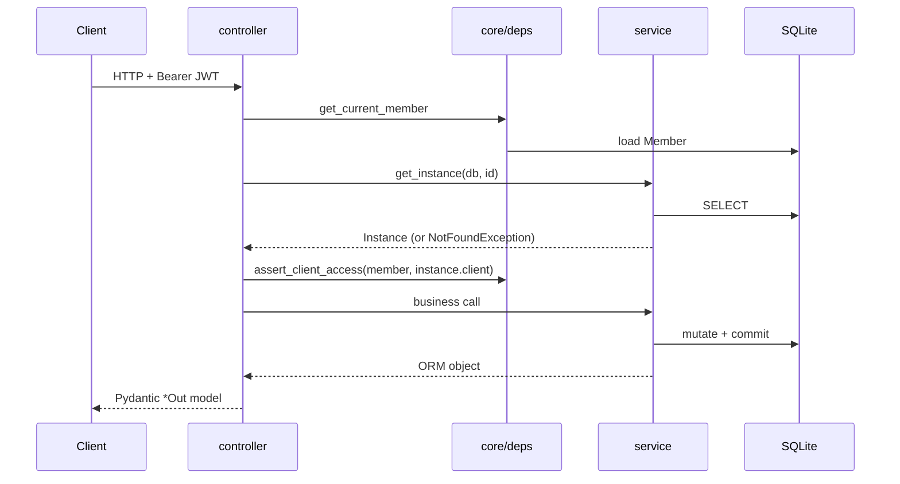

# Reading Order — Understanding This Codebase Function by Function

A guided path through the source in `app/`, in the order that makes each function
understandable by the time you reach it. This is not a reference table to look things up
in — read it top to bottom with the source open beside it.

The path follows one rule: **never read a function before the things it calls.**
Configuration before the session factory, the session factory before the models, the
models before the services, the services before the controllers that delegate to them.

- **Time:** about 2–3 hours end to end; ~40 minutes for Stages 0–4 alone, which is enough
  to change code safely inside one vertical slice.
- **Prerequisites:** Python, and enough FastAPI to recognise `Depends`. SQLAlchemy 2.0 and
  Pydantic v2 details are explained where they first appear.
- **Scope:** 77 numbered stops across the 17 source files under `app/`, plus the seed and
  the test fixtures.

---

## Stage map

| Stage | What you learn | Files | Stops |
|---:|---|---|---:|
| [0](#stage-0--run-it-before-you-read-it) | What the API does from outside | — | — |
| [1](#stage-1--the-entry-point) | How the app is assembled | `main.py` | 7 |
| [2](#stage-2--foundations-config-session-tables-dtos) | Settings, session, tables, DTOs | `config.py`, `database.py`, `models/`, `schemas/` | 10 |
| [3](#stage-3--authentication-and-role-scoping) | Who the caller is, and what they may see | `core/`, `auth_controller.py` | 13 |
| [4](#stage-4--the-reference-vertical-slice-instances) | The pattern every feature follows | `instance_service.py`, `instance_controller.py` | 12 |
| [5](#stage-5--monitoring-where-the-business-rules-live) | Thresholds, auto-alerts, deduplication | `monitor_service.py`, `monitor_controller.py` | 11 |
| [6](#stage-6--alerts) | Alert history and resolution | `alert_service.py`, `alert_controller.py` | 4 |
| [7](#stage-7--clients-cost-and-sla) | Money and uptime arithmetic | `client_service.py`, `client_controller.py` | 13 |
| [8](#stage-8--the-llm-diagnosis-feature) | The one external call, and its fallback | `llm_service.py` | 4 |
| [9](#stage-9--seed-data-and-tests) | Where the demo numbers come from | `seed.py`, `tests/` | 3 |

---

## Stage 0 — Run it before you read it

Reading a request flow is far faster once you have seen the response it produces.

```bash
uvicorn app.main:app --reload      # Swagger UI at http://127.0.0.1:8000/docs
```

Log in at `POST /api/auth/login` with `admin@techvalley.vn` / `admin123!`, click
**Authorize**, paste the `accessToken`, then call `GET /api/monitor/report`. That single
response touches instances, alerts, cost and role scoping at once — the four things the
rest of this document explains.

Then log in as `lam@techvalley.vn` / `manager123!` and call it again. The numbers shrink,
because that member manages only clients 1–5. Explaining that difference is Stage 3.

Companion documents: [../demo/WALKTHROUGH.md](../demo/WALKTHROUGH.md) walks 29 requests in
order; [../api/OVERVIEW.md](../api/OVERVIEW.md) lists all 19 endpoints.

---

## Stage 1 — The entry point

**File:** [app/main.py](../../app/main.py) — 79 lines, and the map of everything else.

| # | Function | Line | What to take away |
|---:|---|---|---|
| 1 | `lifespan` | [main.py:25](../../app/main.py#L25) | On startup: create tables, then `seed(db)`. This is why a working database exists with no migration step. |
| 2 | `app = FastAPI(...)` | [main.py:32](../../app/main.py#L32) | Title, description and demo credentials shown in Swagger; `lifespan` wired in here. |
| 3 | `active_instance_handler` | [main.py:48](../../app/main.py#L48) | `ActiveInstanceException` → `409` |
| 4 | `not_found_handler` | [main.py:56](../../app/main.py#L56) | `NotFoundException` → `404` |
| 5 | `forbidden_handler` | [main.py:61](../../app/main.py#L61) | `ForbiddenException` → `403` |
| 6 | `validation_handler` | [main.py:66](../../app/main.py#L66) | `ValidationException` → `400` |
| 7 | `health` | [main.py:78](../../app/main.py#L78) | The only endpoint that needs no token |

**The idea worth carrying forward:** services never import `HTTPException`. They raise
domain exceptions, and these four handlers are the single place where a domain failure
becomes an HTTP status code. So when you later read `raise NotFoundException("Client", 42)`
inside a service, you already know where it lands.

Note the two error body shapes this produces — handler-produced errors are
`{"error": ..., "detail": ...}`, while an `HTTPException` raised directly in a controller
is FastAPI's plain `{"detail": ...}`. Both are documented in
[../api/ERRORS.md](../api/ERRORS.md); do not make one match the other without reading it.

---

## Stage 2 — Foundations: config, session, tables, DTOs

Four files, in this order. Each is used by everything after it.

### 2.1 `app/config.py` — every tunable number in the system

[app/config.py](../../app/config.py). One class and two module-level dicts:

- `Settings` — a pydantic-settings `BaseSettings`, so every field can be overridden by an
  environment variable or `.env` entry without touching code. Note `CPU_WARNING_THRESHOLD`
  (80.0) and `LONG_STOPPED_HOURS` (48); Stage 5 is the code that reads them.
- `UNIT_PRICES` — `SMALL 50` / `MEDIUM 120` / `LARGE 250`. Read by Stages 4 and 7.
- `SLA_THRESHOLDS` — `PREMIUM 99.9` / `STANDARD 99` / `BASIC 95`. Read by Stage 7.

**Why it comes first:** every threshold in the business rules is a lookup into one of
these three objects. Once you know them, no later function contains a magic number.

### 2.2 `app/database.py` — two functions, and you must understand `get_db`

[app/database.py](../../app/database.py):

| # | Symbol | Line | What to take away |
|---:|---|---|---|
| 8 | `engine`, `SessionLocal`, `Base` | [database.py:9](../../app/database.py#L9) | `check_same_thread=False` is applied only for SQLite; `Base` is the SQLAlchemy 2.0 `DeclarativeBase` every model inherits. |
| 9 | `_set_sqlite_pragmas` | [database.py:16](../../app/database.py#L16) | Registered on the engine's `connect` event, and only for SQLite: puts each connection in WAL mode with `synchronous=NORMAL` so a writer never blocks readers. Why it exists: [../performance/PERFORMANCE_BUGS.md § PERF-01](../performance/PERFORMANCE_BUGS.md#perf-01). |
| 10 | `get_db` | [database.py:36](../../app/database.py#L36) | A generator dependency: yields a session, closes it in `finally`. |

**The idea worth carrying forward:** `get_db` is the seam the tests use. In
[tests/conftest.py:52](../../tests/conftest.py#L52) it is replaced by a session bound to an
in-memory database — which is why the whole suite runs with no file, no server and no
cleanup. Every controller takes `db: Session = Depends(get_db)`, so overriding this one
function redirects the entire application.

### 2.3 `app/models/models.py` — the five tables

[app/models/models.py](../../app/models/models.py). Read top to bottom; the file is already
in dependency order.

| # | Symbol | Line | What to take away |
|---:|---|---|---|
| 11 | `utcnow` | [models.py:10](../../app/models/models.py#L10) | UTC *without* tzinfo. Every timestamp in the database is naive-UTC, so comparisons never mix aware and naive values. Use this, never `datetime.now()`. |
| 12 | `Role`, `ContractPlan`, `InstanceType`, `InstanceStatus`, `AlertType` | [models.py:14-40](../../app/models/models.py#L14-L40) | Five `str`-based enums, reused verbatim by the Pydantic schemas — so the API accepts and returns exactly these strings. |
| 13 | `Member` | [models.py:43](../../app/models/models.py#L43) | Login identity plus role. The `clients` back-reference is what role scoping is built on. |
| 14 | `Client` | [models.py:56](../../app/models/models.py#L56) | `managerId` — the single column that decides what a `CLIENT_MANAGER` may see. |
| 15 | `Instance` | [models.py:70](../../app/models/models.py#L70) | `monthlyCost` is *stored*, not computed on read. `updatedAt` carries `onupdate=utcnow` — Stage 5 uses it as the "status changed at" clock. |
| 16 | `Alert` | [models.py:94](../../app/models/models.py#L94) | `isResolved` + `resolvedAt`; `cascade="all, delete-orphan"` from `Instance`, so deleting an instance takes its alerts with it. |
| 17 | `CostSnapshot` | [models.py:108](../../app/models/models.py#L108) | **Written by the seed, read by nothing.** A deliberate, documented gap — see [../design/ERD.md](../design/ERD.md). Do not go hunting for the service that queries it. |

### 2.4 `app/schemas/schemas.py` — the wire format

[app/schemas/schemas.py](../../app/schemas/schemas.py). Pydantic v2 models grouped by
feature under comment banners. Skim rather than memorise, but stop at three things:

- `PageResponse[T]` ([schemas.py:82](../../app/schemas/schemas.py#L82)) — the generic
  envelope `{items, total, page, size, totalPages}` returned by every paginated endpoint.
- `InstanceCreate` / `InstanceStatusUpdate`
  ([schemas.py:53](../../app/schemas/schemas.py#L53)) — note `Field(ge=0.0, le=100.0)` on
  `cpuUsage`: out-of-range CPU is rejected by FastAPI as `422` before any service runs.
- `model_config = ConfigDict(from_attributes=True)` on every `*Out` model — this is what
  lets a controller `return instance` (an ORM object) and have it serialised.

**The idea worth carrying forward:** validation expressible as a field constraint lives
here and produces `422`. Validation that needs the database lives in a service and produces
`400` via `ValidationException`. That split explains every status code in
[../api/ERRORS.md](../api/ERRORS.md).

---

## Stage 3 — Authentication and role scoping

This is the stage where reading order matters most: `assert_client_access` is called by
ten endpoints, and none of them make sense until you have read it.

### 3.1 `app/core/exceptions.py` — the four domain exceptions

[app/core/exceptions.py](../../app/core/exceptions.py). Four classes, each mapping to a
handler you already read in Stage 1.

| # | Class | Line | Raised when |
|---:|---|---|---|
| 18 | `ActiveInstanceException` | [exceptions.py:1](../../app/core/exceptions.py#L1) | Deleting a `RUNNING` instance → `409` |
| 19 | `NotFoundException` | [exceptions.py:11](../../app/core/exceptions.py#L11) | Any missing entity, formatted `"{resource} {id} not found"` → `404` |
| 20 | `ForbiddenException` | [exceptions.py:18](../../app/core/exceptions.py#L18) | Declared for cross-tenant access → `403` |
| 21 | `ValidationException` | [exceptions.py:24](../../app/core/exceptions.py#L24) | A business rule rejects otherwise well-formed data → `400` |

### 3.2 `app/core/security.py` — the crypto, bottom-up

[app/core/security.py](../../app/core/security.py). Four pure functions — no database, no
FastAPI, readable in isolation.

| # | Function | Line | What to take away |
|---:|---|---|---|
| 22 | `hash_password` | [security.py:13](../../app/core/security.py#L13) | PBKDF2-SHA256, 260,000 iterations, random 16-byte salt, stored as `pbkdf2_sha256$iterations$salt$digest`. Self-describing, so the parameters can change without a migration. |
| 23 | `verify_password` | [security.py:19](../../app/core/security.py#L19) | Splits that string apart again and compares with `hmac.compare_digest`. A malformed stored value returns `False` rather than raising. |
| 24 | `create_access_token` | [security.py:30](../../app/core/security.py#L30) | Claims: `sub` (member id as a string), `email`, `role`, `exp`. |
| 25 | `decode_access_token` | [security.py:41](../../app/core/security.py#L41) | Verifies signature and expiry; raises PyJWT errors for the caller to translate. |

### 3.3 `app/controllers/auth_controller.py` — the first complete request

[app/controllers/auth_controller.py](../../app/controllers/auth_controller.py).

| # | Function | Line | What to take away |
|---:|---|---|---|
| 26 | `login` | [auth_controller.py:13](../../app/controllers/auth_controller.py#L13) | Look up by email → `verify_password` → `create_access_token`. Note the deliberately vague `"Invalid email or password"`: the same message whether the email is unknown or the password is wrong. |

This is the smallest complete endpoint in the project — request DTO in, response DTO out.
Everything after it is the same shape with more layers.

### 3.4 `app/core/deps.py` — the heart of the authorization model

[app/core/deps.py](../../app/core/deps.py). Read all four in file order; they build on each
other.

| # | Function | Line | What to take away |
|---:|---|---|---|
| 27 | `get_current_member` | [deps.py:13](../../app/core/deps.py#L13) | Bearer token → decode → load the `Member` row. Three distinct 401s: no credentials, expired, invalid. It re-reads the member on every request, so a deleted member's token stops working immediately. |
| 28 | `require_admin` | [deps.py:36](../../app/core/deps.py#L36) | Depends on the previous one and adds a role check. Used by exactly one endpoint: `POST /api/clients`. |
| 29 | `assert_client_access` | [deps.py:42](../../app/core/deps.py#L42) | **The single-object guard.** ADMIN passes; a `CLIENT_MANAGER` passes only if `client.managerId == member.id`. It runs *after* the entity is loaded — so a manager asking for someone else's instance gets `403`, not `404`. |
| 30 | `accessible_client_ids` | [deps.py:53](../../app/core/deps.py#L53) | **The list guard.** Returns `None` for ADMIN, meaning *no filter*; otherwise the manager's client ids. |

**The `None` convention, and the `[-1]` trick.** Every service that lists rows takes
`client_ids: list[int] | None`. `None` means "apply no filter" (ADMIN); a list means
"filter to these". An *empty* list — a manager with no clients — would make `IN ()`
invalid SQL, so the services write `Instance.clientId.in_(client_ids or [-1])`: an id that
matches nothing. That exact expression appears eight times from Stage 4 onward; recognise
it once here and it never needs re-reading.

**Two guards, two situations:** `assert_client_access` for one known object,
`accessible_client_ids` for a query. Every endpoint uses exactly one of them. The rules in
full: [../business-rules/AUTHORIZATION.md](../business-rules/AUTHORIZATION.md).

---

## Stage 4 — The reference vertical slice: instances

Instances are the richest feature and the template for every other one. Read the
**service first, then the controller** — the controller is a thin wrapper and takes
seconds once the service is known.

### 4.1 `app/services/instance_service.py`

[app/services/instance_service.py](../../app/services/instance_service.py).

| # | Function | Line | What to take away |
|---:|---|---|---|
| 31 | `SORTABLE_FIELDS` | [instance_service.py:11](../../app/services/instance_service.py#L11) | An allow-list. `sort` is user input used to pick a column, so an unknown field silently falls back to `id` instead of reaching `getattr`. |
| 32 | `create_instance` | [instance_service.py:17](../../app/services/instance_service.py#L17) | Validates the client exists, then sets `monthlyCost` from `UNIT_PRICES` at creation time — cost is *derived once and stored*, never recomputed on read. |
| 33 | `list_instances` | [instance_service.py:38](../../app/services/instance_service.py#L38) | The one function to read closely: role filter → four optional filters → `-field` descending sort → `count()` then `offset/limit`. Returns `(items, total, total_pages)` for the controller to wrap in `PageResponse`. |
| 34 | `get_instance` | [instance_service.py:78](../../app/services/instance_service.py#L78) | Load or `NotFoundException`. Used by the two functions below and by four controllers — the single load-or-404 point. |
| 35 | `update_status` | [instance_service.py:85](../../app/services/instance_service.py#L85) | **Read the comment at line 88.** A PATCH that changes nothing returns early without touching `updatedAt`, because Stage 5 treats `updatedAt` as "when the status last changed". Without this guard, polling the same PATCH would reset the 48-hour clock forever. Also: moving to a non-RUNNING status zeroes `cpuUsage` unless one is supplied. |
| 36 | `delete_instance` | [instance_service.py:110](../../app/services/instance_service.py#L110) | The assignment's headline rule: `RUNNING` → `ActiveInstanceException` → `409`. Alerts cascade away with the row. |

### 4.2 `app/controllers/instance_controller.py`

[app/controllers/instance_controller.py](../../app/controllers/instance_controller.py).
Six endpoints; four of them reduce to the same three steps — load, guard, delegate.

| # | Function | Line | Guard used |
|---:|---|---|---|
| 37 | `create_instance` | [instance_controller.py:20](../../app/controllers/instance_controller.py#L20) | `assert_client_access` on the target client — a manager cannot create an instance under someone else's client |
| 38 | `list_instances` | [instance_controller.py:37](../../app/controllers/instance_controller.py#L37) | `accessible_client_ids`; note `Query(ge=1, le=100)` bounding `size`, and the tuple unpacked into `PageResponse` |
| 39 | `get_instance` | [instance_controller.py:57](../../app/controllers/instance_controller.py#L57) | `assert_client_access(member, instance.client)` |
| 40 | `update_status` | [instance_controller.py:72](../../app/controllers/instance_controller.py#L72) | same |
| 41 | `delete_instance` | [instance_controller.py:88](../../app/controllers/instance_controller.py#L88) | same; returns `204` |
| 42 | `diagnose_instance` | [instance_controller.py:103](../../app/controllers/instance_controller.py#L103) | same; loads the 10 most recent alerts, then calls Stage 8 |

**The shape you have now learned** — and it holds for all 19 endpoints:



Once this diagram is in your head, Stages 5–7 are only about *what the service computes*.

---

## Stage 5 — Monitoring: where the business rules live

[app/services/monitor_service.py](../../app/services/monitor_service.py) — the densest file
in the project, and the one whose three private helpers explain the other four functions.

| # | Function | Line | What to take away |
|---:|---|---|---|
| 43 | `_has_unresolved_alert` | [monitor_service.py:11](../../app/services/monitor_service.py#L11) | Is there already an open alert of this type on this instance? |
| 44 | `_record_alert` | [monitor_service.py:24](../../app/services/monitor_service.py#L24) | **The deduplication rule.** Adds an alert *unless* an unresolved one of the same type exists. This is why calling `GET /api/monitor/warnings` ten times produces one alert, not ten — and why resolving an alert lets the next scan raise a fresh one. |
| 45 | `_commit_if_recorded` | [monitor_service.py:33](../../app/services/monitor_service.py#L33) | Commits a scan **only if** it actually inserted something. A poll that dedup silenced writes nothing, so it must not take SQLite's write lock either — why this exists: [../performance/PERFORMANCE_BUGS.md § PERF-01](../performance/PERFORMANCE_BUGS.md#perf-01). |
| 46 | `check_warnings` | [monitor_service.py:44](../../app/services/monitor_service.py#L44) | `cpuUsage >= 80` **and** status `RUNNING` — a stopped instance's stale CPU reading never warns. Records `CPU_HIGH` per hit, with at most one `commit` for the batch — and none at all when dedup skipped every insert. |
| 47 | `check_errors` | [monitor_service.py:66](../../app/services/monitor_service.py#L66) | Status `ERROR` → `ERROR_DETECTED`, message prefixed `[CRITICAL]`. |
| 48 | `check_long_stopped` | [monitor_service.py:83](../../app/services/monitor_service.py#L83) | `STOPPED` and `updatedAt <= now - 48h` → `LONG_STOPPED`. This is the function that depends on the idempotent-PATCH guard from stop 35; read the two as a pair. |
| 49 | `build_report` | [monitor_service.py:108](../../app/services/monitor_service.py#L108) | Read-only, unlike the three above. Counts by status via `GROUP BY`, warning count, `SUM(monthlyCost)` wrapped in `coalesce` so an empty scope returns `0.0` rather than `None`, and unresolved alerts newest-first. |

**The surprise worth internalising:** three of these are `GET` endpoints that *write* to the
database. Scanning is what creates alerts — there is no scheduler in this system. If you
never call `/api/monitor/warnings`, no `CPU_HIGH` alert ever exists. That design and its
trade-offs: [../business-rules/ALERTING.md](../business-rules/ALERTING.md).

**Controller** —
[app/controllers/monitor_controller.py](../../app/controllers/monitor_controller.py): four
one-line endpoints, each passing `accessible_client_ids(member, db)` straight through.

| # | Function | Line |
|---:|---|---|
| 50 | `warnings` | [monitor_controller.py:18](../../app/controllers/monitor_controller.py#L18) |
| 51 | `errors` | [monitor_controller.py:27](../../app/controllers/monitor_controller.py#L27) |
| 52 | `long_stopped` | [monitor_controller.py:36](../../app/controllers/monitor_controller.py#L36) |
| 53 | `report` | [monitor_controller.py:45](../../app/controllers/monitor_controller.py#L45) |

---

## Stage 6 — Alerts

The consumer side of what Stage 5 produces.
[app/services/alert_service.py](../../app/services/alert_service.py).

| # | Function | Line | What to take away |
|---:|---|---|---|
| 54 | `list_alerts` | [alert_service.py:10](../../app/services/alert_service.py#L10) | Alerts carry no `clientId`, so scoping needs `join(Instance)` — the join *is* the role filter. Date filters widen a `date` to `time.min` / `time.max`, so `dateTo` includes the whole day. |
| 55 | `resolve_alert` | [alert_service.py:32](../../app/services/alert_service.py#L32) | Idempotent: an already-resolved alert is returned unchanged, and `resolvedAt` is not overwritten. |

**Controller** —
[app/controllers/alert_controller.py](../../app/controllers/alert_controller.py):

| # | Function | Line | What to take away |
|---:|---|---|---|
| 56 | `list_alerts` | [alert_controller.py:20](../../app/controllers/alert_controller.py#L20) | Four optional query filters, all `None` by default |
| 57 | `resolve_alert` | [alert_controller.py:39](../../app/controllers/alert_controller.py#L39) | Loads the alert itself to reach `alert.instance.client` for the guard — the one place a controller queries directly, and the one place a `404` comes from a raw `HTTPException` rather than a domain exception |

---

## Stage 7 — Clients, cost and SLA

[app/services/client_service.py](../../app/services/client_service.py) — seven functions,
and the last two hold the only real arithmetic in the codebase.

| # | Function | Line | What to take away |
|---:|---|---|---|
| 58 | `create_client` | [client_service.py:12](../../app/services/client_service.py#L12) | The `ValidationException` case: `managerId` must belong to a member whose role is `CLIENT_MANAGER`. Assigning a client to an ADMIN is `400`, not `422` — the check needs the database. |
| 59 | `list_clients` | [client_service.py:34](../../app/services/client_service.py#L34) | The `None` / `or [-1]` convention again. |
| 60 | `get_client` | [client_service.py:41](../../app/services/client_service.py#L41) | Load-or-404, used by all four below and by `create_instance`. |
| 61 | `get_client_instances` | [client_service.py:48](../../app/services/client_service.py#L48) | Validates the client first, so a missing client gives `404` rather than an empty list. |
| 62 | `get_client_cost` | [client_service.py:53](../../app/services/client_service.py#L53) | Sums the **stored** `monthlyCost` of *all* instances regardless of status, plus a per-instance breakdown. |
| 63 | `get_cost_forecast` | [client_service.py:77](../../app/services/client_service.py#L77) | The contrast that matters: the forecast counts **only `RUNNING`** instances, priced from `UNIT_PRICES`. Current cost ≠ forecast, by design — [../business-rules/COST.md](../business-rules/COST.md) explains why. |
| 64 | `get_sla` | [client_service.py:110](../../app/services/client_service.py#L110) | **Read the docstring before the code.** There is no status-history table, so uptime is approximated: the window runs `max(month start, launchedAt)` → now; an instance counts as up until now if `RUNNING`, or until `updatedAt` otherwise. The client figure is the mean across instances, compared against its plan threshold. An honest approximation, documented as one in [../business-rules/SLA.md](../business-rules/SLA.md). |

**Controller** —
[app/controllers/client_controller.py](../../app/controllers/client_controller.py). Six
endpoints; the first uses `require_admin`, the rest `get_client` + `assert_client_access`.

| # | Function | Line |
|---:|---|---|
| 65 | `create_client` | [client_controller.py:26](../../app/controllers/client_controller.py#L26) |
| 66 | `list_clients` | [client_controller.py:35](../../app/controllers/client_controller.py#L35) |
| 67 | `client_instances` | [client_controller.py:40](../../app/controllers/client_controller.py#L40) |
| 68 | `client_cost` | [client_controller.py:51](../../app/controllers/client_controller.py#L51) |
| 69 | `client_cost_forecast` | [client_controller.py:66](../../app/controllers/client_controller.py#L66) |
| 70 | `client_sla` | [client_controller.py:81](../../app/controllers/client_controller.py#L81) |

---

## Stage 8 — The LLM diagnosis feature

[app/services/llm_service.py](../../app/services/llm_service.py) — the only outbound
network call in the system, and the only function that must never fail.

Read it **bottom-up**: `diagnose` is three lines and tells you what the other three are for.

| # | Function | Line | What to take away |
|---:|---|---|---|
| 71 | `_build_context` | [llm_service.py:19](../../app/services/llm_service.py#L19) | Formats instance fields plus recent alerts into plain text — shared by the prompt, and easy to test. |
| 72 | `_llm_diagnosis` | [llm_service.py:39](../../app/services/llm_service.py#L39) | The Anthropic SDK call, with `import anthropic` *inside* the function so the dependency stays optional. Two comments worth reading: the SDK never reads `.env`, so the key is handed over explicitly; and adaptive thinking spends the same token budget, so `max_tokens` is generous. **Any** exception returns `None`. |
| 73 | `_rule_based_diagnosis` | [llm_service.py:83](../../app/services/llm_service.py#L83) | A deterministic fallback in the same three-section format, built from CPU level, alert history, instance type and region. |
| 74 | `diagnose` | [llm_service.py:113](../../app/services/llm_service.py#L113) | Try the LLM, fall back, return `(text, source)` — `source` is surfaced in the response so a caller can always tell which path ran. |

**The design point:** this endpoint has no failure mode. No API key, no network, a bad
response — all produce a useful answer with `source: "rule-based"`, which is why the demo
and the test suite run without credentials. Full design:
[../design/LLM_FEATURE.md](../design/LLM_FEATURE.md).

---

## Stage 9 — Seed data and tests

### 9.1 `app/seed.py`

[app/seed.py](../../app/seed.py) — one function, `seed` ([seed.py:22](../../app/seed.py#L22)),
guarded by an early return when any member already exists, so it is idempotent across
restarts. It creates 3 members, 10 clients, 15 instances and 10 cost snapshots.

Read the `instances` list ([seed.py:78](../../app/seed.py#L78)) carefully — it is built to
exercise every rule you have just read:

| Seeded case | Rule it demonstrates |
|---|---|
| `health-api-01` 96.3%, `vinasoft-web-01` 91.5%, `fintech-core-02` 88.4%, `hnlog-api-01` 85.2% | four `CPU_HIGH` warnings (stop 46) |
| `hnlog-worker-01`, `dnmedia-stream-01` in `ERROR` | `ERROR_DETECTED` and the diagnosis endpoint (stops 47, 74) |
| `sgretail-report-01` 120h, `green-iot-01` 96h, `vinasoft-batch-01` 72h stopped | `LONG_STOPPED` past the 48h threshold (stop 48) |
| clients 1–5 → `lam@`, clients 6–10 → `minh@` | role scoping (stops 29, 30) |

Exact figures: [../demo/SEED_DATA.md](../demo/SEED_DATA.md).

### 9.2 `tests/`

[tests/conftest.py](../../tests/conftest.py) first — three fixtures, and they explain how
104 tests run in seconds:

| # | Fixture | Line | What to take away |
|---:|---|---|---|
| 75 | `memoised_seed_hashing` | [conftest.py:16](../../tests/conftest.py#L16) | Session-scoped: memoises `hash_password` *for the seed only*, because 260,000 PBKDF2 iterations × 3 passwords × every test dominated the runtime. `verify_password` still does real work on every login. |
| 76 | `api` | [conftest.py:33](../../tests/conftest.py#L33) | A fresh in-memory SQLite database per test, held open by `StaticPool`, seeded, and injected by overriding `get_db` (stop 10). Note the `engine.dispose()` in `finally`. |
| 77 | `auth_headers` | [conftest.py:68](../../tests/conftest.py#L68) | Logs in as all three demo accounts and returns ready-made `Authorization` headers — most tests start here. |

Then read the suites in the same order as this document:

| File | Covers | Stages |
|---|---|---|
| [tests/test_auth.py](../../tests/test_auth.py) | login, token, 401 paths | 3 |
| [tests/test_instances.py](../../tests/test_instances.py) | CRUD, pagination, sort, `409` | 4 |
| [tests/test_member_c.py](../../tests/test_member_c.py) | status changes and monitoring scope | 4, 5 |
| [tests/test_alerts.py](../../tests/test_alerts.py) | filters, resolve, deduplication | 5, 6 |
| [tests/test_clients.py](../../tests/test_clients.py) | scoping, cost, forecast, SLA | 7 |
| [tests/test_diagnosis.py](../../tests/test_diagnosis.py) | fallback path, `source` field | 8 |

The tests are the executable version of the business rules: when a document and the code
disagree, [tests/](../../tests/) is the tie-breaker. What each suite asserts:
[../testing/FUNCTIONAL_TESTS.md](../testing/FUNCTIONAL_TESTS.md).

---

## Checkpoints

Answer these from memory before moving on. If one is hard, the stage to re-read is named.

| # | Question | Stage |
|---:|---|---|
| 1 | A service raises `NotFoundException`. Where does it become a `404`? | 1 |
| 2 | Why is `utcnow()` naive rather than timezone-aware? | 2 |
| 3 | What does `client_ids = None` mean, and why `or [-1]`? | 3 |
| 4 | A manager requests another manager's instance — `403` or `404`, and why? | 3, 4 |
| 5 | Why does an unchanged `PATCH /status` deliberately do nothing? | 4, 5 |
| 6 | Why does calling `/monitor/warnings` twice create only one alert? | 5 |
| 7 | Why is `GET /api/clients/1/cost` different from `/cost-forecast`? | 7 |
| 8 | What makes the diagnosis endpoint work with no API key? | 8 |
| 9 | Where do the four seeded CPU warnings come from? | 9 |

---

## Traps this codebase sets for newcomers

Each of these looks like a bug and is not. All are documented; do not "fix" one without
reading the linked document first.

| Looks wrong | Actually | Documented in |
|---|---|---|
| `GET` endpoints that write alerts | There is no scheduler; scanning *is* the detection | [../business-rules/ALERTING.md](../business-rules/ALERTING.md) |
| `PATCH` that returns early without saving | Protects the 48-hour `LONG_STOPPED` clock | [../business-rules/INSTANCE_LIFECYCLE.md](../business-rules/INSTANCE_LIFECYCLE.md) |
| `cost_snapshots` written but never read | A known, deliberate gap | [../design/ERD.md](../design/ERD.md) |
| Two different error body shapes | Handler-produced vs. raw `HTTPException` | [../api/ERRORS.md](../api/ERRORS.md) |
| SLA uptime called "approximate" | No status-history table exists to be exact against | [../business-rules/SLA.md](../business-rules/SLA.md) |
| `in_(client_ids or [-1])` | Guards against invalid `IN ()` for a manager with no clients | [../business-rules/AUTHORIZATION.md](../business-rules/AUTHORIZATION.md) |
| Cost stored on the row, not computed | Priced once at creation, from `UNIT_PRICES` | [../business-rules/COST.md](../business-rules/COST.md) |

---

## Where to go next

| Now that you can read the code… | Go to |
|---|---|
| Change something | [../contributing/DOCUMENTATION.md](../contributing/DOCUMENTATION.md) — which document your change must update |
| Commit it | [../contributing/COMMITS.md](../contributing/COMMITS.md) |
| Add a test | [../testing/RUNNING_TESTS.md](../testing/RUNNING_TESTS.md) |
| Understand a layer more deeply | [../design/ARCHITECTURE.md](../design/ARCHITECTURE.md) |
| Look up an endpoint's contract | [../api/ENDPOINTS.md](../api/ENDPOINTS.md) |
| See what is slow before optimising | [../performance/PERFORMANCE_BUGS.md](../performance/PERFORMANCE_BUGS.md) |
