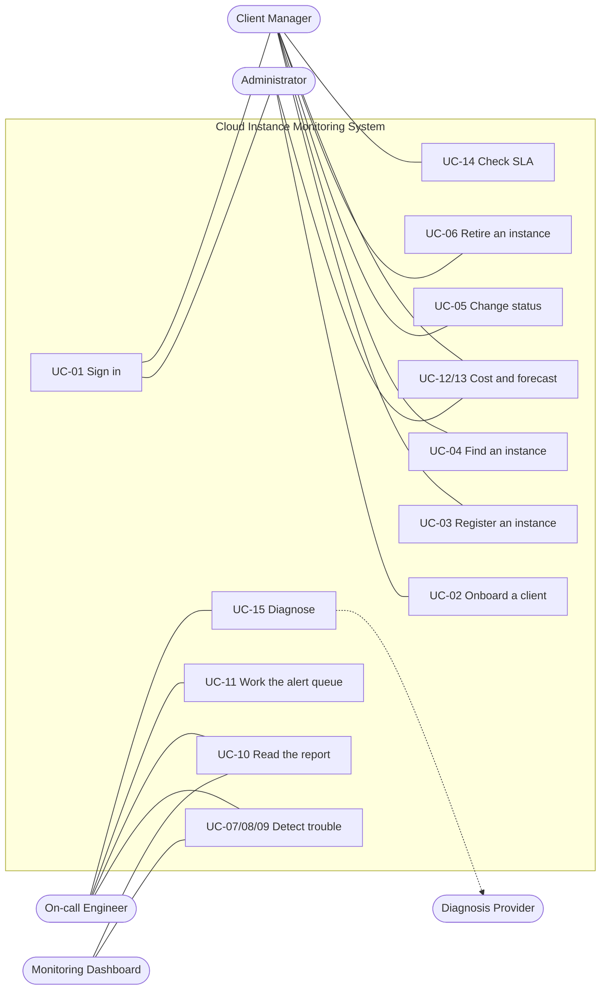

# Use Cases and User Stories

| | |
|---|---|
| System | TechValley Cloud Instance Monitoring System |
| Document | Use Case / User Story specification |
| Status | Baseline — describes the delivered system |
| Owner | TechValley Developer Track team |
| Last reviewed | 2026-09-01 |

How people interact with the system, as scenarios rather than as endpoints. Each use case
names its actor, its trigger, the main flow, what happens when the flow goes wrong, and
the rules that make the outcome what it is. The functions behind them are specified in
[FRS.md](FRS.md).

**Contents** — [Actors](#1-actors) · [Diagram](#2-use-case-diagram) ·
[Index](#3-use-case-index) · [Use cases](#4-use-cases) ·
[User stories](#5-user-stories) · [Traceability](#6-traceability)

---

## 1. Actors

| Actor | Type | Description |
|---|---|---|
| **Administrator** | Primary, human | A member with role `ADMIN`. Sees every client and instance; the only actor who may onboard a client company |
| **Client Manager** | Primary, human | A member with role `CLIENT_MANAGER`. Everything they do is restricted to the clients assigned to them |
| **On-call Engineer** | Primary, human | Either role, acting during an incident. Distinguished because their goals differ, not their permissions |
| **Monitoring Dashboard** | Primary, system | An automated client polling the monitoring endpoints on a schedule. It authenticates as a member and has that member's scope |
| **Diagnosis Provider** | Supporting, external | The Anthropic API. Optional: when it is unreachable the system answers from deterministic rules instead |

Note that **client companies are not actors**. They are data. Their manager reports to
them from the system; they never sign in ([BRD § 4.2](BRD.md#42-out-of-scope)).

---

## 2. Use case diagram

Every use case except UC-01 includes UC-01: nothing is reachable without a token.

---

## 3. Use case index

| ID | Use case | Primary actor | Priority | Function |
|---|---|---|:--:|---|
| [UC-01](#uc-01--sign-in) | Sign in | Any member | High | [F-AUTH-01](FRS.md#f-auth-01--log-in) |
| [UC-02](#uc-02--onboard-a-client-company) | Onboard a client company | Administrator | High | [F-CLNT-01](FRS.md#f-clnt-01--register-a-client) |
| [UC-03](#uc-03--register-an-instance) | Register an instance | Client Manager | High | [F-INST-01](FRS.md#f-inst-01--register-an-instance) |
| [UC-04](#uc-04--find-an-instance) | Find an instance | Client Manager | High | [F-INST-02](FRS.md#f-inst-02--list-instances) |
| [UC-05](#uc-05--change-an-instances-status) | Change an instance's status | Client Manager | High | [F-INST-04](FRS.md#f-inst-04--update-status) |
| [UC-06](#uc-06--retire-an-instance) | Retire an instance | Client Manager | High | [F-INST-05](FRS.md#f-inst-05--delete-an-instance) |
| [UC-07](#uc-07--find-overloaded-instances) | Find overloaded instances | On-call Engineer | High | [F-MON-01](FRS.md#f-mon-01--scan-for-high-cpu-instances) |
| [UC-08](#uc-08--find-failed-instances) | Find failed instances | On-call Engineer | High | [F-MON-02](FRS.md#f-mon-02--scan-for-failed-instances) |
| [UC-09](#uc-09--find-idle-instances) | Find idle instances | Client Manager | Medium | [F-MON-03](FRS.md#f-mon-03--scan-for-long-stopped-instances) |
| [UC-10](#uc-10--read-the-morning-report) | Read the morning report | On-call Engineer | High | [F-MON-04](FRS.md#f-mon-04--aggregate-monitoring-report) |
| [UC-11](#uc-11--work-the-alert-queue) | Work the alert queue | On-call Engineer | High | [F-ALRT-01](FRS.md#f-alrt-01--list-alert-history), [F-ALRT-02](FRS.md#f-alrt-02--resolve-an-alert) |
| [UC-12](#uc-12--report-a-clients-monthly-cost) | Report a client's monthly cost | Client Manager | High | [F-CLNT-04](FRS.md#f-clnt-04--current-month-cost) |
| [UC-13](#uc-13--forecast-next-months-cost) | Forecast next month's cost | Client Manager | Medium | [F-CLNT-05](FRS.md#f-clnt-05--next-month-cost-forecast) |
| [UC-14](#uc-14--check-a-clients-sla) | Check a client's SLA | Client Manager | High | [F-CLNT-06](FRS.md#f-clnt-06--sla-uptime) |
| [UC-15](#uc-15--diagnose-an-unhealthy-instance) | Diagnose an unhealthy instance | On-call Engineer | Medium | [F-DIAG-01](FRS.md#f-diag-01--diagnose-an-instance) |

---

## 4. Use cases

Values in the examples are the seeded demo data
([../demo/SEED_DATA.md](../demo/SEED_DATA.md)), so every flow below can be run as written.

### UC-01 — Sign in

| | |
|---|---|
| **Actor** | Any member |
| **Goal** | Obtain a token that authorises the rest of the session |
| **Trigger** | The member wants to use the system |
| **Preconditions** | The member account exists |
| **Postconditions** | The member holds a token valid for 120 minutes |

**Main flow**

1. The member submits their email and password to `POST /api/auth/login`.
2. The system verifies the password against the stored hash.
3. The system returns `accessToken`, `tokenType`, and the member's `role` and `name`.
4. The member sends `Authorization: Bearer <token>` on every later request.

**Alternative flows**

| | Condition | Outcome |
|---|---|---|
| **A1** | Wrong password, or an email with no account | `401 Invalid email or password` — the same message either way, so the endpoint cannot be used to discover which staff accounts exist |
| **A2** | Malformed email | `422` from schema validation, before any lookup |
| **A3** | The token later expires | `401 Token has expired`. There is no refresh endpoint; the member signs in again |
| **A4** | The member's account is deleted after the token was issued | `401 Member no longer exists` on the next call — the member row is re-read on every request |

**Rules** — the token carries `role`, but authorization always reads the role from the
freshly loaded member row, never from the claim.

### UC-02 — Onboard a client company

| | |
|---|---|
| **Actor** | Administrator |
| **Goal** | Bring a new client company into the system with a responsible manager |
| **Preconditions** | Signed in as `ADMIN`; the intended manager exists as a `CLIENT_MANAGER` |
| **Postconditions** | The client exists and appears in exactly one manager's scope |

**Main flow**

1. The administrator submits `clientName`, `contractPlan` and `managerId` to
   `POST /api/clients`.
2. The system confirms the caller is an administrator.
3. The system loads the member named by `managerId` and confirms their role is
   `CLIENT_MANAGER`.
4. The client is created and returned with `201`.
5. The named manager can immediately see the client in their own listing.

**Alternative flows**

| | Condition | Outcome |
|---|---|---|
| **A1** | Caller is a `CLIENT_MANAGER` | `403 ADMIN role required`; nothing is written |
| **A2** | `managerId` names no member | `404 NotFound` |
| **A3** | `managerId` names an **administrator** | `400 ValidationError` — every client must be owned by a manager, or it would be invisible on the manager path |
| **A4** | Unknown `contractPlan`, empty `clientName` | `422` |

### UC-03 — Register an instance

| | |
|---|---|
| **Actor** | Client Manager (or Administrator) |
| **Goal** | Bring a cloud instance under monitoring for one client |
| **Preconditions** | Signed in; the target client is within the caller's scope |
| **Postconditions** | The instance exists with a server-derived monthly cost |

**Main flow**

1. The manager submits `instanceName`, `region`, `instanceType` and `clientId`, optionally
   `status` and `cpuUsage`.
2. The system loads the client and confirms the caller may access it.
3. The system derives `monthlyCost` from `instanceType` — SMALL `$50`, MEDIUM `$120`,
   LARGE `$250` — and stamps `launchedAt` with the current server time.
4. The instance is created and returned with `201`.
5. The client's current-month cost ([UC-12](#uc-12--report-a-clients-monthly-cost))
   immediately reflects the new instance.

**Alternative flows**

| | Condition | Outcome |
|---|---|---|
| **A1** | `clientId` belongs to another manager | `403`, and nothing is written — the check runs before the insert |
| **A2** | `clientId` names no client | `404 NotFound` |
| **A3** | `cpuUsage` outside `0–100`, unknown enum, empty name | `422` |
| **A4** | The caller supplies `monthlyCost` | Ignored. Pricing is a business rule, not caller input |

### UC-04 — Find an instance

| | |
|---|---|
| **Actor** | Client Manager |
| **Goal** | Locate instances by status, client, region, type or load |
| **Preconditions** | Signed in |

**Main flow**

1. The manager calls `GET /api/instances` with any combination of `status`, `clientId`,
   `region`, `instanceType`, plus `sort` and `page`/`size`.
2. The system applies the caller's scope, then the filters, then the ordering.
3. The response is one page of instances with `total`, `page`, `size` and `totalPages`.

**Alternative flows**

| | Condition | Outcome |
|---|---|---|
| **A1** | `clientId` names another manager's client | An **empty list**, not `403`. Filters narrow visibility; they can never widen it |
| **A2** | `sort` names a field that does not exist | Ordering silently falls back to `id` rather than failing |
| **A3** | `page` beyond the last page | `200` with an empty `items` array |
| **A4** | `size=101`, `page=0` | `422` |

**Rules** — `total` is the count after scoping and filtering, so a manager is never told
how many rows exist outside their scope.

### UC-05 — Change an instance's status

| | |
|---|---|
| **Actor** | Client Manager, or an automation reporting state |
| **Goal** | Record that an instance is now running, stopped or failed |
| **Preconditions** | Signed in; the instance is in scope |
| **Postconditions** | Status and CPU reflect the report; `updatedAt` moves **only if something changed** |

**Main flow**

1. The caller sends the target `status`, optionally `cpuUsage`, to
   `PATCH /api/instances/{id}/status`.
2. The system loads the instance and confirms access.
3. If the target status is `STOPPED` or `ERROR` and no CPU value was supplied, CPU is
   reset to `0.0`.
4. If the resulting status and CPU differ from the stored values, both are written and
   `updatedAt` is set to now.
5. The updated instance is returned.

**Alternative flows**

| | Condition | Outcome |
|---|---|---|
| **A1** | Nothing actually changed | The instance is returned unchanged and `updatedAt` is **not** moved — this is what keeps the 48-hour idle clock and the SLA window honest |
| **A2** | An explicit `cpuUsage` is supplied with a stop | The supplied value wins over the reset |
| **A3** | The instance belongs to another manager | `403` |
| **A4** | `cpuUsage` outside `0–100`, or `status` missing | `422` |

**Rules** — there is no state machine: any status may follow any other, because a real
instance can go from `ERROR` straight to `RUNNING` after a restart.

### UC-06 — Retire an instance

| | |
|---|---|
| **Actor** | Client Manager |
| **Goal** | Remove an instance that is no longer operated |
| **Preconditions** | Signed in; the instance is in scope and **not** `RUNNING` |
| **Postconditions** | The instance and its alerts are gone; the client's cost drops |

**Main flow**

1. The manager stops the instance ([UC-05](#uc-05--change-an-instances-status)).
2. The manager calls `DELETE /api/instances/{id}`.
3. The system confirms the instance is not `RUNNING` and deletes it.
4. Its alerts are removed with it, and `204` is returned with no body.

**Alternative flows**

| | Condition | Outcome |
|---|---|---|
| **A1** | The instance is `RUNNING` | `409 ActiveInstanceException` — `Instance {id} is RUNNING and cannot be deleted. Stop it first.` Deleting the record of a live instance would leave real infrastructure running, unmonitored and still billing |
| **A2** | The instance belongs to another manager | `403` — the scope check runs before the delete |
| **A3** | Already deleted | `404` |

**Rules** — deletion is permanent and takes the incident history with it. There is no soft
delete.

### UC-07 — Find overloaded instances

| | |
|---|---|
| **Actor** | On-call Engineer, or the Monitoring Dashboard |
| **Goal** | See which running instances are out of CPU headroom, and have that recorded |
| **Preconditions** | Signed in |
| **Postconditions** | An open `CPU_HIGH` alert exists for every matching instance in scope |

**Main flow**

1. The actor calls `GET /api/monitor/warnings`.
2. The system finds every in-scope instance that is `RUNNING` with `cpuUsage ≥ 80`.
3. For each one **without** an open `CPU_HIGH` alert, it records one, embedding the
   reading: `CPU usage 91.5% >= 80% on instance 'vinasoft-web-01' (ap-southeast-1)`.
4. It returns the requested page of matching instances.

**Alternative flows**

| | Condition | Outcome |
|---|---|---|
| **A1** | The scan is repeated while the condition persists | The same instances are returned, and **no** new alerts are created. The count is unchanged after the first scan |
| **A2** | A page smaller than the match set is requested | Detection still covers **every** match — an instance on page 8 raises its alert whether or not anyone asks for page 8 |
| **A3** | The actor is a manager | Only their own clients' instances are scanned and alerted on |
| **A4** | An earlier alert was resolved and the condition still holds | A **fresh** alert is opened — resolution re-arms detection |

**Rules** — this is a `GET` that writes rows. There is no scheduler in the system, so the
read is the trigger; the duplicate guard is what keeps that harmless
([ALERTING § 2](../business-rules/ALERTING.md#2-detection-writes-alerts)).

### UC-08 — Find failed instances

Same shape as [UC-07](#uc-07--find-overloaded-instances), with:

| | |
|---|---|
| **Endpoint** | `GET /api/monitor/errors` |
| **Condition** | `status == ERROR` |
| **Alert** | `ERROR_DETECTED`, marked critical: `[CRITICAL] Instance 'hnlog-worker-01' (ap-southeast-1) is in ERROR state` |
| **Seeded example** | Instances `5` and `9` |

An instance that recovers to `RUNNING` **keeps** its open alert until someone resolves it.
Nothing auto-resolves, because auto-closing would erase the record that the incident
happened.

### UC-09 — Find idle instances

Same shape as [UC-07](#uc-07--find-overloaded-instances), with:

| | |
|---|---|
| **Endpoint** | `GET /api/monitor/long-stopped` |
| **Condition** | `STOPPED` for at least 48 hours, measured from `updatedAt` |
| **Alert** | `LONG_STOPPED` |
| **Seeded example** | Instances `3`, `7`, `13` |
| **Business goal** | Surface provisioned capacity nobody is using, so it can be decommissioned before it is billed again |

**Rule** — this use case is the reason [UC-05](#uc-05--change-an-instances-status) must not
move `updatedAt` on a no-op update. A dashboard re-asserting `STOPPED` every minute would
otherwise reset the clock, and a forgotten instance would never appear here.

### UC-10 — Read the morning report

| | |
|---|---|
| **Actor** | On-call Engineer, or the Monitoring Dashboard |
| **Goal** | Answer "what is the state of the estate right now?" in one call |
| **Preconditions** | Signed in |
| **Postconditions** | None — this use case changes nothing |

**Main flow**

1. The actor calls `GET /api/monitor/report`.
2. The system aggregates over the instances the caller can see and returns: counts by
   status (zero-filled for all three), the warning count, the total monthly cost across
   every status, the number of unresolved alerts, and the 20 most recent of them.

**Alternative flows**

| | Condition | Outcome |
|---|---|---|
| **A1** | More than 20 alerts are open | `unresolvedAlertCount` reports the true total while `unresolvedAlerts` shows the 20 newest. The full history is [UC-11](#uc-11--work-the-alert-queue) |
| **A2** | The actor is a manager | Every figure covers their clients only. On the seeded data the two managers' totals sum to the administrator's — `$1,260 + $840 = $2,100` |

**Rules** — the report records **no** alerts; it is the one monitoring endpoint that is
purely a read.

### UC-11 — Work the alert queue

| | |
|---|---|
| **Actor** | On-call Engineer |
| **Goal** | Review what has been detected and mark handled items closed |
| **Preconditions** | Signed in; at least one scan has run |
| **Postconditions** | Handled alerts carry `isResolved` and a `resolvedAt` stamp |

**Main flow**

1. The engineer calls `GET /api/alerts`, optionally filtering by `alertType`,
   `isResolved`, `dateFrom` and `dateTo`.
2. The system returns one page, newest detection first.
3. The engineer investigates an alert — often via
   [UC-15](#uc-15--diagnose-an-unhealthy-instance) — and fixes the underlying problem.
4. The engineer calls `PATCH /api/alerts/{id}/resolve`.
5. The alert is stamped resolved and drops out of the report's unresolved count.

**Alternative flows**

| | Condition | Outcome |
|---|---|---|
| **A1** | The same alert is resolved twice | `200`, and the original `resolvedAt` is preserved — the record of *when* it was handled cannot be overwritten |
| **A2** | The alert belongs to another manager's client | `403`, and the alert stays unresolved |
| **A3** | Unknown alert id | `404`, with a `{detail}`-only body (no `error` key) — a documented inconsistency with the other `404`s |
| **A4** | The condition still holds after resolution | The next scan opens a **new** alert. An operator who marks a CPU alert handled without the CPU coming down is told again |

**Rules** — history is ordered `detectedAt` descending with `id` descending as a
tiebreaker, because one scan stamps every alert it writes with the same instant.

### UC-12 — Report a client's monthly cost

| | |
|---|---|
| **Actor** | Client Manager, for a finance or client conversation |
| **Goal** | State what a client company costs this month, and why |
| **Preconditions** | Signed in; the client is in scope |

**Main flow**

1. The manager calls `GET /api/clients/{id}/cost`.
2. The system sums `monthlyCost` across **all** the client's instances, of every status.
3. It returns the month, the instance count, the total, and a per-instance breakdown
   carrying each instance's type and status.

**Alternative flows**

| | Condition | Outcome |
|---|---|---|
| **A1** | The client has stopped or failed instances | They are **included**. A provisioned instance is committed spend for the month whether or not it runs; their `status` in the breakdown is the operator's cue to decommission |
| **A2** | The client belongs to another manager | `403` |
| **A3** | Unknown client | `404` |

**Rules** — this response is not paginated. The total must cover every instance, so the
rows are loaded anyway.

### UC-13 — Forecast next month's cost

| | |
|---|---|
| **Actor** | Client Manager |
| **Goal** | Say what next month looks like if nothing changes |

**Main flow**

1. The manager calls `GET /api/clients/{id}/cost-forecast`.
2. The system counts only instances **currently running**, groups them by type, and
   reports count, unit price and subtotal per type plus the total.
3. `forecastMonth` is next calendar month.

**Alternative flows**

| | Condition | Outcome |
|---|---|---|
| **A1** | Nothing is running | `forecastCost: 0.0` with an empty breakdown — not an error |
| **A2** | A stopped instance is started | The forecast rises on the next call; the current-month cost does not move, because it already counted it |
| **A3** | The month is December | `forecastMonth` rolls the year — `2026-12` → `2027-01` |

**Rules** — the difference from [UC-12](#uc-12--report-a-clients-monthly-cost) is the
point: current cost is what is *already committed*; the forecast is what next month looks
like, and a stopped instance is a signal it is on its way out.

### UC-14 — Check a client's SLA

| | |
|---|---|
| **Actor** | Client Manager |
| **Goal** | See whether a client is meeting the uptime its contract plan promises |

**Main flow**

1. The manager calls `GET /api/clients/{id}/sla`.
2. The system looks up the plan's threshold — PREMIUM `99.9`, STANDARD `99.0`,
   BASIC `95.0`.
3. It computes each instance's uptime for the current month and averages them.
4. It returns the percentage, the violation flag, and per-instance `measuredHours` and
   `runningHours`.

**Alternative flows**

| | Condition | Outcome |
|---|---|---|
| **A1** | The client has no instances | `100.0%`, `isViolation: false` — nothing to fail |
| **A2** | Uptime exactly equals the threshold | **Not** a violation; the comparison is strict |
| **A3** | An instance was launched mid-month | Its window starts at `launchedAt`, so it is not penalised for time before it existed |

**Rules — and a limit that changes how the answer may be used**

The figure is an **approximation**: the system stores only the most recent status change,
so an instance that failed and recovered three times this month is credited with full
uptime. Use it to spot a client in trouble now; **do not quote it to a client as measured
downtime** ([SLA § 3.1](../business-rules/SLA.md#31-what-the-approximation-gets-wrong)).
The per-instance hours are in the response precisely so the number can be audited rather
than trusted.

### UC-15 — Diagnose an unhealthy instance

| | |
|---|---|
| **Actor** | On-call Engineer |
| **Supporting actor** | Diagnosis Provider (optional) |
| **Goal** | Get a first-line written explanation and a list of actions without waiting for a senior engineer |

**Main flow**

1. The engineer calls `GET /api/instances/{id}/diagnosis`.
2. The system gathers the instance's metadata and its 10 most recent alerts.
3. It asks the model for a write-up in three sections — probable causes, recommended
   actions, prevention — bounded at 30 seconds with at most one retry.
4. It returns the text with `source: "llm"`.

**Alternative flows**

| | Condition | Outcome |
|---|---|---|
| **A1** | No API key is configured | A deterministic rule-based write-up with the same three sections, `source: "rule-based"`, status `200` |
| **A2** | The provider times out, errors, or returns nothing | Identical to A1. **A provider problem is never a `5xx`** — the feature must never be the reason an operator gets no answer |
| **A3** | The instance is healthy | Still answered; the endpoint is not restricted to failed instances |
| **A4** | The instance belongs to another manager | `403` |

**Rules** — the response always names its own origin in `source`, so an engineer knows
whether they are reading a model's reasoning or a rule table. The request releases its
database connection before the provider call, so a slow diagnosis does not hold one.

---

## 5. User stories

The same requirements in story form, grouped by epic, each with acceptance criteria
written as Given / When / Then. "Verified by" names the automated test that holds the
story to its criteria.

### Epic A — Access and accounts

| | Story | Acceptance criteria | Verified by |
|---|---|---|---|
| **US-01** | As a **member**, I want to exchange my email and password for a token, so that I can use the system | **Given** valid credentials **when** I log in **then** I receive a token, my role and my name, and the token authorises a real call | `login_returns_a_usable_token_with_role_and_name` |
| **US-02** | As a **security-conscious operator**, I want failed logins to be indistinguishable, so that the endpoint cannot be used to discover who has an account | **Given** a wrong password **or** an unknown email **when** I log in **then** both return the same `401` body | `login_rejects_bad_credentials_without_revealing_which_part_failed` |
| **US-03** | As an **administrator**, I want a deleted member's token to stop working immediately, so that removing someone actually removes their access | **Given** a valid token **when** the member row is deleted **then** the next call returns `401 Member no longer exists` | `token_for_a_member_that_no_longer_exists_is_rejected` |
| **US-04** | As a **client manager**, I want to see only my own clients, so that I cannot damage another manager's account by mistake | **Given** I manage clients 1–5 **when** I list anything **then** I see only those clients' data, and `total` counts only them | `client_list_pagination_counts_only_the_callers_clients` |
| **US-05** | As an **administrator**, I want to be the only role that can onboard a client, so that account ownership stays deliberate | **Given** I am a manager **when** I register a client **then** I get `403 ADMIN role required` and nothing is written | `client_registration_is_admin_only` |

### Epic B — The instance register

| | Story | Acceptance criteria | Verified by |
|---|---|---|---|
| **US-06** | As a **client manager**, I want an instance's price derived from its size, so that cost figures cannot be wrong because someone typed a number | **Given** I register a MEDIUM instance **when** it is created **then** `monthlyCost` is `120.0` regardless of what I sent | `create_instance_derives_cost_and_applies_defaults` |
| **US-07** | As a **client manager**, I want to filter and sort the register, so that I can find instances without reading all of them | **Given** 15 instances **when** I ask for `status=RUNNING&sort=-cpuUsage` **then** I get only running instances, busiest first | `list_instances_filters`, `list_instances_sorts` |
| **US-08** | As a **client manager**, I want stopping an instance to zero its CPU, so that it stops appearing in the warning list | **Given** an instance at 91.5% **when** I stop it without giving a CPU value **then** its CPU becomes `0.0` | `stopping_an_instance_resets_cpu_and_advances_updated_at` |
| **US-09** | As an **operator running an automation**, I want a repeated identical update to change nothing, so that polling does not reset how long an instance has been stopped | **Given** a stopped instance **when** I send the same status again **then** `updatedAt` is unchanged | `status_change_is_scoped_and_idempotent` |
| **US-10** | As a **client manager**, I want to be stopped from deleting a running instance, so that I cannot orphan live infrastructure | **Given** a RUNNING instance **when** I delete it **then** I get `409` with instructions to stop it first, and the row survives | `running_instance_cannot_be_deleted` |
| **US-11** | As a **client manager**, I want deleting an instance to take its alerts with it, so that no alert points at something that no longer exists | **Given** an instance with alerts **when** I stop and delete it **then** its alerts are gone from the history | `deleting_an_instance_removes_its_alerts_from_the_history` |

### Epic C — Detection and alerts

| | Story | Acceptance criteria | Verified by |
|---|---|---|---|
| **US-12** | As an **on-call engineer**, I want overloaded, failed and idle instances found for me, so that I do not have to read the whole register | **Given** the seeded estate **when** I run the three scans **then** I get warnings `[1,4,11,14]`, errors `[5,9]` and idle `[3,7,13]` | `warnings_are_scoped_auto_recorded_and_deduplicated`, `error_and_long_stopped_monitoring_auto_record_without_duplicates` |
| **US-13** | As an **on-call engineer**, I want each detection recorded, so that an incident is not lost when I close the browser | **Given** a scan **when** it finds a match **then** an alert exists in the history with the reading in its message | `alert_history_carries_the_detection_message` |
| **US-14** | As an **operator polling every 30 seconds**, I want repeat scans not to pile up duplicates, so that the alert list stays usable | **Given** a scan has run **when** I run it again **then** the same instances come back and no new alert is created | `warnings_are_scoped_auto_recorded_and_deduplicated` |
| **US-15** | As an **on-call engineer**, I want detection to cover every match even when I ask for one page, so that nothing goes unseen because of how a dashboard pages | **Given** four matching instances **when** I scan with `size=1` **then** one instance is returned and four alerts are recorded | `a_scan_records_alerts_for_every_match_not_only_the_page` |
| **US-16** | As an **on-call engineer**, I want resolving an alert to re-arm detection, so that an unfixed problem is raised again rather than silently ignored | **Given** a resolved CPU alert **when** the CPU is still high at the next scan **then** a new alert is opened | `warnings_are_scoped_auto_recorded_and_deduplicated` |
| **US-17** | As an **on-call engineer**, I want the resolution timestamp to be write-once, so that the handling record cannot be overwritten by a repeated click | **Given** a resolved alert **when** I resolve it again **then** `resolvedAt` does not move | `resolving_an_alert_stamps_it_once` |
| **US-18** | As an **on-call engineer**, I want one summary of the estate, so that I can start a shift in a single call | **Given** the seeded estate **when** I read the report **then** I see counts by status, warnings, `$2,100` total cost, and the open alerts | `full_report_and_manager_scope` |

### Epic D — Cost, forecast and SLA

| | Story | Acceptance criteria | Verified by |
|---|---|---|---|
| **US-19** | As a **client manager**, I want current cost to include stopped instances, so that the figure matches what we actually committed to | **Given** VinaSoft with a stopped instance **when** I read its cost **then** the total is `$620`, including it | `current_cost_sums_every_instance_regardless_of_status` |
| **US-20** | As a **client manager**, I want a forecast that counts only what is running, so that I can show what next month looks like if we decommission the rest | **Given** two running LARGE instances **when** I read the forecast **then** it is `$500` with a `LARGE` breakdown only | `forecast_counts_only_running_instances` |
| **US-21** | As a **client manager**, I want the forecast to react to a status change, so that the number is current rather than cached | **Given** I start a stopped instance **when** I read the forecast again **then** it has risen accordingly | `forecast_reacts_to_a_status_change` |
| **US-22** | As a **client manager**, I want uptime measured against the client's own plan, so that a BASIC client is not judged by a PREMIUM promise | **Given** a STANDARD client **when** I read its SLA **then** the threshold shown is `99.0` | `sla_reports_full_uptime_when_every_instance_is_running` |
| **US-23** | As a **client manager**, I want the per-instance hours in the response, so that I can audit a violation instead of trusting a single number | **Given** a violation **when** I read `instanceDetails` **then** each instance shows `measuredHours` and `runningHours` | `sla_flags_a_violation_for_a_long_stopped_instance` |

### Epic E — Diagnosis

| | Story | Acceptance criteria | Verified by |
|---|---|---|---|
| **US-24** | As an **on-call engineer**, I want a written diagnosis of an unhealthy instance, so that I can act before a senior engineer is free | **Given** an instance in ERROR **when** I ask for a diagnosis **then** I get probable causes, recommended actions and prevention | `diagnosis_uses_the_model_answer_when_one_is_available` |
| **US-25** | As an **operator with no API key**, I want the endpoint to answer anyway, so that a demo or an offline deployment is not broken by a missing credential | **Given** no key **when** I ask for a diagnosis **then** I get `200` with `source: "rule-based"` and the same three sections | `diagnosis_falls_back_to_a_rule_based_answer` |
| **US-26** | As an **on-call engineer**, I want provider failures hidden, so that I never see a `500` while handling an incident | **Given** the provider raises **when** I ask for a diagnosis **then** I still get `200` with a rule-based answer | `diagnosis_survives_a_provider_failure` |

### Epic F — Working with the responses

| | Story | Acceptance criteria | Verified by |
|---|---|---|---|
| **US-27** | As an **API consumer**, I want every listing to page the same way, so that I write the paging logic once | **Given** any list endpoint **when** I pass `page` and `size` **then** I get the same envelope with `total`, `page`, `size` and `totalPages` | `list_instances_paginates`, `alert_history_is_paginated`, `client_list_is_paginated` |
| **US-28** | As an **API consumer**, I want pages to partition a result set exactly, so that walking them visits every row once | **Given** a sort on a non-unique field **when** I walk every page **then** each row appears exactly once | `pages_partition_a_non_unique_sort_without_gaps_or_repeats` |
| **US-29** | As an **API consumer**, I want an over-large page request to be an empty result rather than an error, so that a paging loop terminates cleanly | **Given** `page=99` **when** the data ends earlier **then** I get `200` with empty `items` | `alert_history_page_past_the_end_is_empty_not_404` |
| **US-30** | As a **support engineer**, I want error bodies to say what went wrong in words, so that I can act without reading the source | **Given** any failure **when** I read the body **then** `detail` names the resource and the reason | Failure cases across every suite |

---

## 6. Traceability

| Use case | Stories | Business requirement | Function | Test cases |
|---|---|---|---|---|
| UC-01 | US-01, US-02, US-03 | BR-06 | F-AUTH-01, F-AUTH-02 | [TC-AUTH-*](../testing/TEST_CASES.md#41-authentication--tc-auth) |
| UC-02 | US-05 | BR-02, BR-05 | F-CLNT-01 | [TC-CLNT-01…05](../testing/TEST_CASES.md#45-clients-cost-and-sla--tc-clnt) |
| UC-03 | US-06 | BR-01 | F-INST-01 | [TC-INST-01…05](../testing/TEST_CASES.md#42-instances--tc-inst) |
| UC-04 | US-07, US-27, US-28, US-29 | BR-03, BR-18 | F-INST-02, F-X-01 | [TC-INST-06…13](../testing/TEST_CASES.md#42-instances--tc-inst) |
| UC-05 | US-08, US-09 | BR-15 | F-INST-04 | [TC-INST-15…18](../testing/TEST_CASES.md#42-instances--tc-inst) |
| UC-06 | US-10, US-11 | BR-14 | F-INST-05 | [TC-INST-19…22](../testing/TEST_CASES.md#42-instances--tc-inst) |
| UC-07, UC-08, UC-09 | US-12, US-13, US-14, US-15 | BR-07, BR-09 | F-MON-01…03 | [TC-MON-01…09](../testing/TEST_CASES.md#43-monitoring--tc-mon) |
| UC-10 | US-18 | BR-10 | F-MON-04 | [TC-MON-10…12](../testing/TEST_CASES.md#43-monitoring--tc-mon) |
| UC-11 | US-16, US-17 | BR-08 | F-ALRT-01, F-ALRT-02 | [TC-ALRT-*](../testing/TEST_CASES.md#44-alerts--tc-alrt) |
| UC-12, UC-13 | US-19, US-20, US-21 | BR-11, BR-12 | F-CLNT-04, F-CLNT-05 | [TC-CLNT-11…17, 23](../testing/TEST_CASES.md#45-clients-cost-and-sla--tc-clnt) |
| UC-14 | US-22, US-23 | BR-13 | F-CLNT-06 | [TC-CLNT-18…21](../testing/TEST_CASES.md#45-clients-cost-and-sla--tc-clnt) |
| UC-15 | US-24, US-25, US-26 | BR-16, BR-17 | F-DIAG-01 | [TC-DIAG-*](../testing/TEST_CASES.md#46-diagnosis--tc-diag) |

---

## 7. Related

| Document | Why |
|---|---|
| [BRD.md](BRD.md) | The business requirement behind each use case |
| [SRS.md](SRS.md) | The software requirement each one realises |
| [FRS.md](FRS.md) | Field-level detail for every step above |
| [../testing/TEST_CASES.md](../testing/TEST_CASES.md) | The executable version of these flows |
| [../demo/WALKTHROUGH.md](../demo/WALKTHROUGH.md) | A 29-step run through most of these use cases with real numbers |
| [../manual/USER_MANUAL.md](../manual/USER_MANUAL.md) | The same tasks written as instructions for the person doing them |
